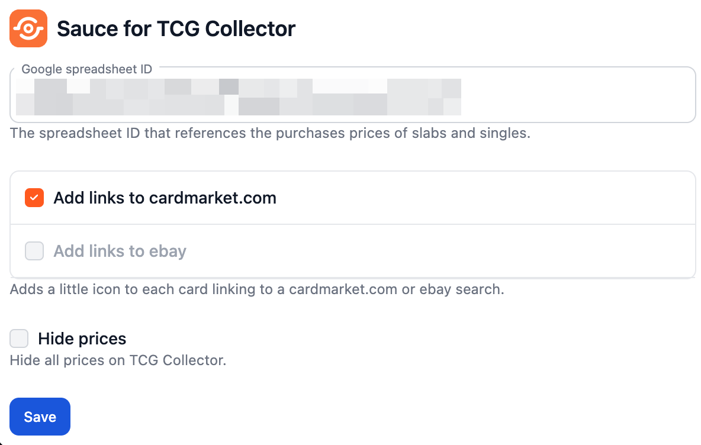

	

---

Sauce for TCG Collector is a browser extension that upgrades [tcgcollector.com](https://www.tcgcollector.com/) with more features.

Installation
--------

- Make a copy of [this spreadsheet](https://docs.google.com/spreadsheets/d/1B_O4S7XzTfC9X_esMogMnj0rNHbzkSfGhN0PgRbf2Zc) and start filling it out
- Clone this repository
- Enable developer mode in Chrome (or any Chromium based browser)
- Enable this extension
- Reference your Google spreadsheet ID in the options

Feature highlights
--------

* Hide prices on TCG Collector
* Manage & display purchases prices for cards
* Links to slab certifications
* Visualize the value of your collection trough time
* Manage the quick access links on the dashboard
* Re-arrange dashboard and get rid of clutter
* Print placeholders for your binders
* Add [cardmarket.com](https://www.cardmarket.com) or Ebay links to card overviews