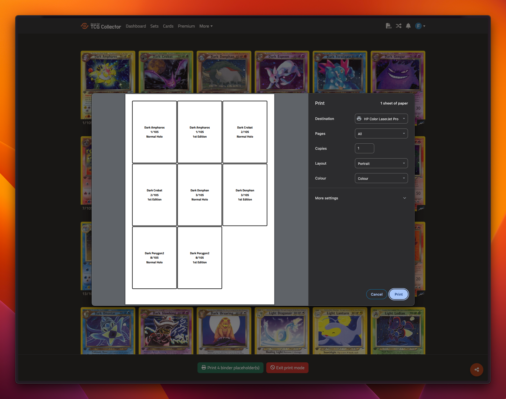
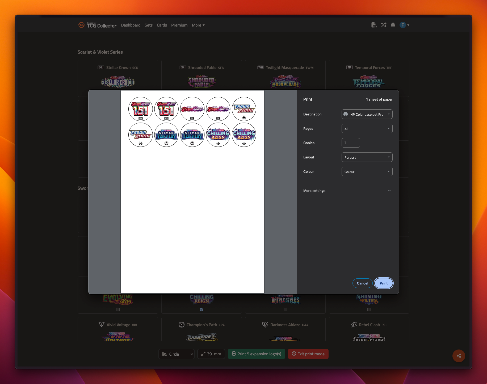

	

---

Sauce for TCG Collector is a browser extension that adds printing features to [tcgcollector.com](https://www.tcgcollector.com/).

Installation
--------

- Clone this repository
- Run `npm install && npm run build`
- Enable developer mode in Chrome (or any Chromium based browser)
- Load this directory as an unpacked extension

Feature highlights
--------

### Print placeholders for your binders

### Print set logos

